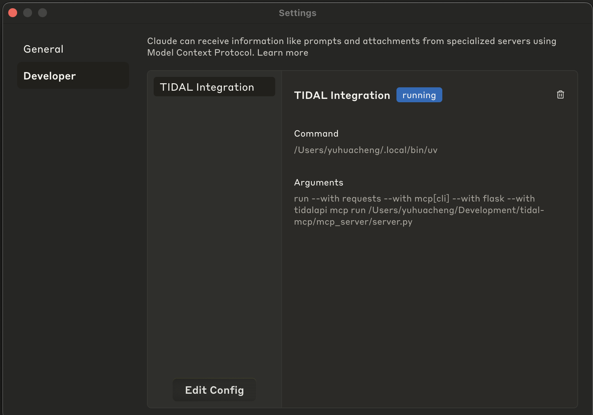

# TIDAL MCP: My Custom Picks 🌟🎧


<a href="https://glama.ai/mcp/servers/@yuhuacheng/tidal-mcp">
  
</a>

When exploring music on platforms like Spotify or TIDAL, there’s no shortage of recommendation features — Daily Discovery, New Arrivals, Top Artists, and more. But more often than not, I'd like something more direct and customizable. For example:

> *"Based on my last 10 favorites, find similar tracks — but only ones from recent years."*

> *"Find me tracks like those in this playlist, but slower and more acoustic."*

Even with state-of-the-art recommendation systems, the results often feel too "aggregated" and not tuned to what I want **right now**.

TIDAL MCP bridges that gap by giving an LLM access to your favorites, playlists, and its **track radio** API, letting it find similar tracks based on any seeds you pick. It then layers in additional filtering — using the LLM’s knowledge or external tools like web search — to match your specific vibe. Finally, it can create new playlists for you directly in your TIDAL account.

## Features

- 🌟 **Music Recommendations**: Get personalized track recommendations based on your listening history **plus your custom criteria**.
- ၊၊||၊ **Playlist Management**: Create, view, and manage your TIDAL playlists

## Quick Start

### Prerequisites

- Python 3.10+
- [uv](https://github.com/astral-sh/uv) (Python package manager)
- TIDAL subscription

### Installation

1. Clone this repository:
   ```bash
   git clone https://github.com/yuhuacheng/tidal-mcp.git
   cd tidal-mcp
   ```

2. Create a virtual environment and install dependencies using uv:
   ```bash
   uv venv
   source .venv/bin/activate  # On Windows: .venv\Scripts\activate
   ```

3. Install the package with all dependencies from the pyproject.toml file:
   ```bash
   uv pip install --editable .
   ```

   This will install all dependencies defined in the pyproject.toml file and set up the project in development mode.


## MCP Client Configuration

### Claude Desktop Configuration

To add this MCP server to Claude Desktop, you need to update the MCP configuration file. Here's an example configuration:
(you can specify the port by adding an optional `env` section with the `TIDAL_MCP_PORT` environment variable)

```json
{
  "mcpServers": {
    "TIDAL Integration": {
      "command": "/path/to/your/uv",
      "env": {
        "TIDAL_MCP_PORT": "5100"
      },
      "args": [
        "run",
        "--with",
        "requests",
        "--with",
        "mcp[cli]",
        "--with",
        "flask",
        "--with",
        "tidalapi",
        "mcp",
        "run",
        "/path/to/your/project/tidal-mcp/mcp_server/server.py"
      ]
    }
  }
}
```

Example scrrenshot of the MCP configuration in Claude Desktop:


### Steps to Install MCP Configuration

1. Open Claude Desktop
2. Go to Settings > Developer
3. Click on "Edit Config"
4. Paste the modified JSON configuration
5. Save the configuration
6. Restart Claude Desktop

## Suggested Prompt Starters
Once configured, you can interact with your TIDAL account through a LLM by asking questions like:

- *“Recommend songs like those in this playlist, but slower and more acoustic.”*
- *“Create a playlist based on my top tracks, but focused on chill, late-night vibes.”*
- *“Find songs like these in playlist XYZ but in languages other than English.”*

*💡 You can also ask the model to:*
- Use more tracks as seeds to broaden the inspiration.
- Return more recommendations if you want a longer playlist.
- Or delete a playlist if you’re not into it — no pressure!

## Available Tools

The TIDAL MCP integration provides the following tools:

- `tidal_login`: Authenticate with TIDAL through browser login flow
- `get_favorite_tracks`: Retrieve your favorite tracks from TIDAL
- `recommend_tracks`: Get personalized music recommendations
- `create_tidal_playlist`: Create a new playlist in your TIDAL account
- `get_user_playlists`: List all your playlists on TIDAL
- `get_playlist_tracks`: Retrieve all tracks from a specific playlist
- `delete_tidal_playlist`: Delete a playlist from your TIDAL account

## License

[MIT License](LICENSE)

## Acknowledgements

- [Model Context Protocol (MCP)](https://github.com/modelcontextprotocol/python-sdk)
- [TIDAL Python API](https://github.com/tamland/python-tidal)